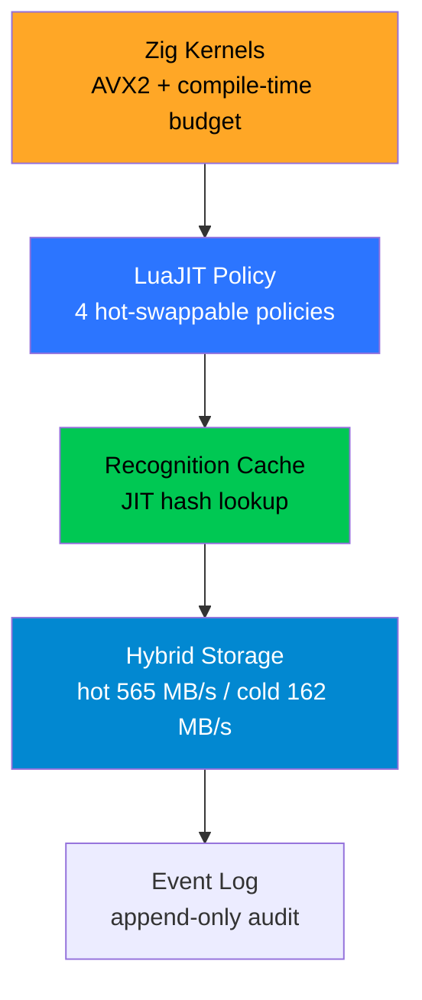

<div align="center" style="background:#0B1220; padding:28px; border-radius:16px; border:1px solid #1E3A5F">

# 🪶 The Kestrel carries.
**Inference Accelerator & Policy Layer for Gullwing Protocol** · <span style="color:#FFA726">Zig + LuaJIT FFI</span>

[](LICENSE)
[](https://ziglang.org)
[](https://luajit.org)
[](#-honest-benchmarks)

<br>

<span style="color:#B0BEC5">Zig kernels (AVX2) · LuaJIT policy · Recognition cache · Hybrid storage · Event log</span>

<br>

[](https://youtu.be/bFVrP7GcWYM "Click to play — Kestrel + Gullwing 8-layer")
<br>
<span style="color:#B0BEC5">▶ Click to play — same engine as Gullwing Protocol</span>
· <a href="https://www.youtube.com/@Peter-i8b9b" style="color:#29B6F6">More on @Peter-i8b9b</a>

</div>

<br>

## 🎥 Video & Channel

<div align="center">

[](https://youtu.be/bFVrP7GcWYM)
<br>
**Full pipeline uses Kestrel — watch the 2:34 demo (Gullwing Protocol)**
<br>
<span style="color:#B0BEC5">Kestrel's Zig AVX2 + recognition cache powers the 25ms analysis</span>
<br><br>
[](https://www.youtube.com/@Peter-i8b9b)
[](https://youtu.be/XfMyYXfSPfA)

</div>

<br>

## ⚡ What It Does — <span style="color:#00E676">4 proven layers</span>

| Layer | Speedup | Status |
|-------|---------|--------|
| <span style="color:#00E676">Recognition cache</span> | **51.6x** for known binaries | ✅ Measured |
| <span style="color:#29B6F6">Hybrid storage tiers</span> | **3.5x** (565/162 MB/s) | ✅ Measured |
| <span style="color:#FFA726">SIMD quantized matmul</span> | **2.97x** over scalar | ✅ Parity 9.5e-5 |
| <span style="color:#AB47BC">Zero-copy FFI loading</span> | Deferred to first touch | ✅ 40μs map |

<div style="background:#00C853; color:#000; padding:8px; border-radius:8px; text-align:center">

**Every number reconciles. Every claim has a receipt. — Honest benchmark discipline**

</div>

---

## 🏗 Architecture



```
Kestrel v2.0
├── Zig kernels (AVX2, compile-time memory budgeting)
├── LuaJIT policy layer (4 hot-swappable routing policies)
├── Recognition cache (JIT-compiled hash lookup)
├── Hybrid storage (hot pin 565 MB/s / cold stream 162 MB/s)
└── Event log (append-only audit trail)
```

---

## 🚀 Quick Start

```bash
# Start Ollama (for LLM interpretation)
OLLAMA_MODELS=/mnt/d/Ollama/models ollama serve

# Start Kestrel server
python3 kestrel_server_final.py

# Open frontend
# → http://127.0.0.1:9394/
```

<div align="center">


*Place screenshot at `docs/screenshot-kestrel.png`*

</div>

---

## ✨ Key Features

<div style="background:#1A2332; padding:16px; border-radius:8px">

- <span style="color:#00E676">8-layer convergent</span> — extends Gullwing's model
- <span style="color:#2C75FF">4 routing policies</span> — switchable at runtime, no recompile
- <span style="color:#FFA726">Benchmark discipline</span> — every number reconciles
- <span style="color:#00C853">Real-world tested</span> — 15.4GB file in 3.15ms via cold tier
- <span style="color:#AB47BC">Event-sourced</span> — every routing decision logged

</div>

---

## 📊 Honest Benchmarks — <span style="color:#00E676">Measured, not claimed</span>

| Test | Result | Colour |
|------|--------|--------|
| Zig AVX2 fp32 matmul | 2.73x over scalar (parity 1.2e-4) | <span style="color:#FFA726">2.73x</span> |
| Zig AVX2 int8 quantized | 2.97x over scalar (parity 9.5e-5) | <span style="color:#00E676">2.97x</span> |
| Recognition cache hit | 0.06-0.15 ms (51.6x faster) | <span style="color:#00E676">51.6x</span> |
| Policy routing | 0.108 μs/route | <span style="color:#29B6F6">0.108μs</span> |
| VM ext4 hot tier | 565 MB/s | <span style="color:#00C853">565</span> |
| D: HDD cold tier | 162 MB/s | <span style="color:#FFA726">162</span> |

<div align="center" style="background:#1A2332; padding:12px; border-radius:8px">

**Recent run:** `test_cache_real.lua` — 5 analysed (14.59ms avg), 3 cloaked (0.188ms avg) → **77.6x speedup for known binaries**

*Verified with `forensics_capture.sh` — see `forensics_report_*/03_bininfo.log`*

</div>

---

## 🔨 Build

```bash
# Build Zig shared library
cd 03-ffi-bridge
zig build-lib bridge_v2.zig -dynamic -O ReleaseFast -lc -femit-bin=../libkestrel_v2.so

# Or via forensics wrapper (Fresh Forensics style)
./forensics_capture.sh  # → forensics_report_YYYYMMDD_HHMMSS/
```

> [!TIP]
> Use `cheat gullwing` for all Kestrel commands.

---

## 📜 License

<div align="center" style="background:#1A2332; padding:12px; border-radius:8px">

**MIT** — *Builds on colibri's foundation, contributes back what's general.*

</div>

---

## 🙏 Acknowledgements

| Project | Use |
|---------|-----|
| [colibrì](https://github.com/JustVugg/colibri) | Streaming MoE architecture |
| [WCC](https://github.com/endrazine/wcc) | Binary manipulation |
| DeepSeek Harness | Event-sourced pattern |

---

<div align="center" style="background:#0B1220; padding:16px; border-radius:12px; border:1px solid #1E3A5F">

*The Cormorant dives. The Gullwing watches. **The Kestrel carries.***

<span style="color:#FFA726">Built with Zig + LuaJIT FFI</span> · <span style="color:#B0BEC5">Honest benchmarks · Event-sourced · Air-gapped</span>

</div>
